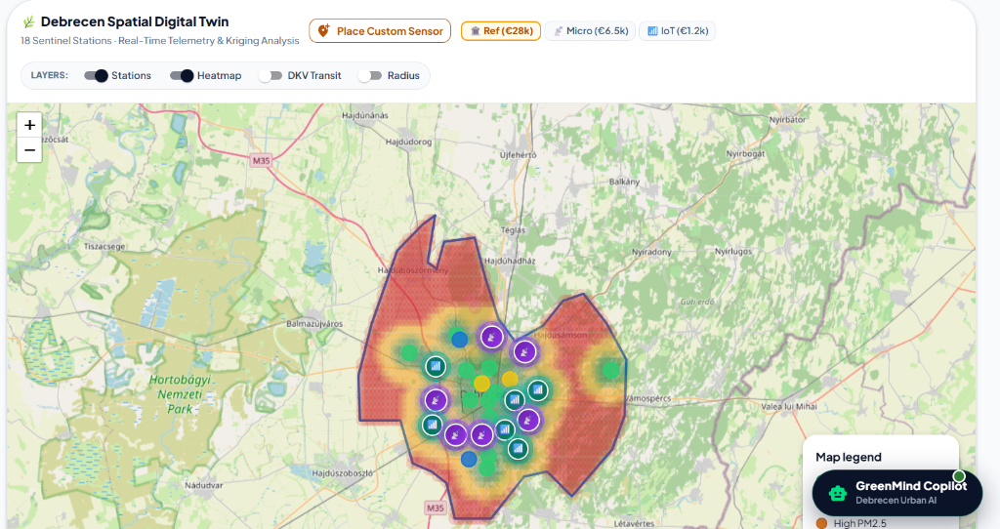
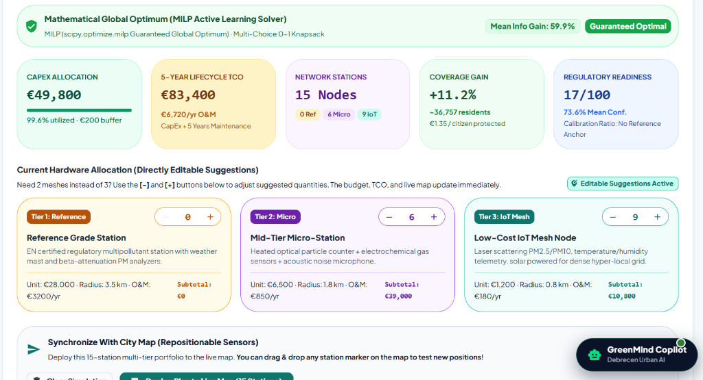
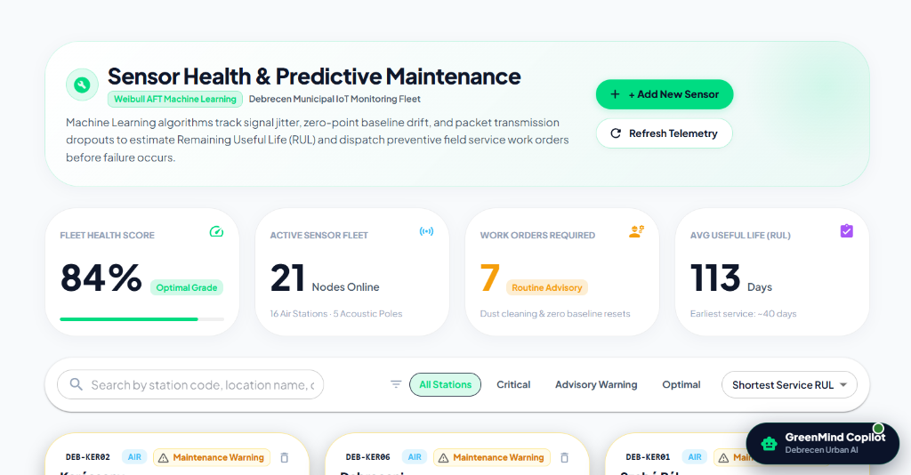
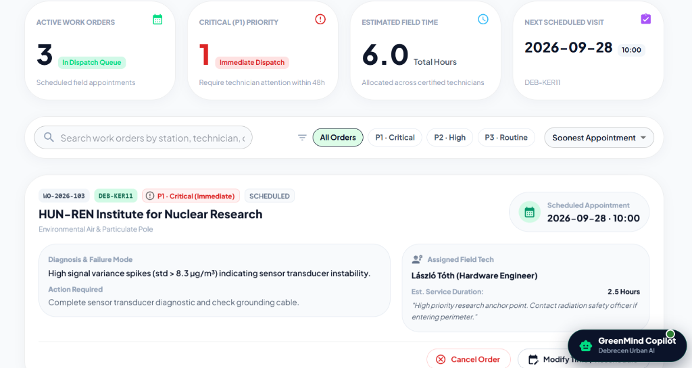
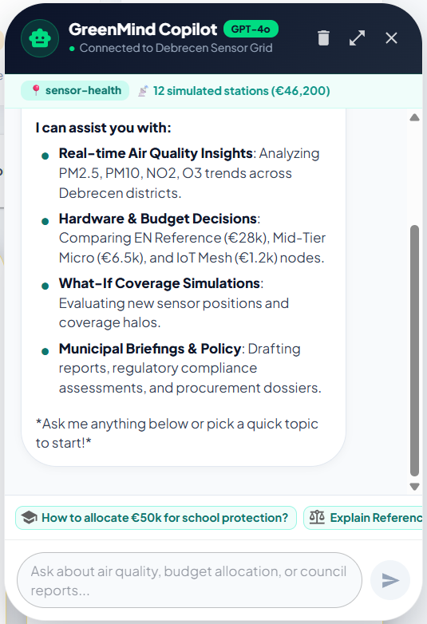
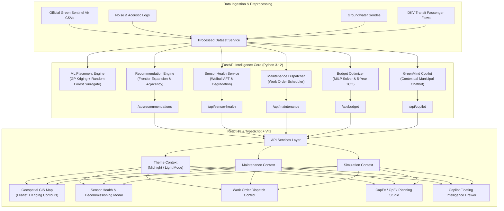

<div align="center">

# 🌿 GreenMind AI
### Autonomous Multi-Environmental Intelligence & Spatial Optimization Platform
**Debrecen Green Sentinel Environmental Monitoring Challenge · Decision Support System**

[](https://fastapi.tiangolo.com)
[](https://www.python.org)
[](https://react.dev)
[](https://www.typescriptlang.org)
[](https://vitejs.dev)
[](https://mui.com)
[](https://leafletjs.com)
[-success?style=for-the-badge&logo=pytest&logoColor=white)](https://docs.pytest.org)

<br/>

<p align="center">
  
</p>

<p align="center">
  <b>GreenMind AI</b> bridges the gap between raw environmental sensor feeds and actionable municipal policy.<br/>
  It powers autonomous network expansion via <b>Gaussian Process Kriging & Frontier AI Placement</b>, solves multi-tier <b>MILP Budget Optimization</b>, forecasts hardware degradation with <b>Weibull AFT Predictive Maintenance</b>, and assists city leaders through the <b>GreenMind Copilot</b>.
</p>

</div>

---

## 📑 Table of Contents

- [🌟 Key Capabilities](#-key-capabilities)
- [📸 Visual Walkthrough & System Screenshots](#-visual-walkthrough--system-screenshots)
  - [1. Central Municipal Operations Control Tower](#1-central-municipal-operations-control-tower)
  - [2. Debrecen Spatial Digital Twin & Real-Time Kriging Heatmap](#2-debrecen-spatial-digital-twin--real-time-kriging-heatmap)
  - [3. Mathematical Global Optimum Budget Optimizer (MILP Solver)](#3-mathematical-global-optimum-budget-optimizer-milp-solver)
  - [4. Sensor Fleet Health Diagnostics & Degradation Tracking](#4-sensor-fleet-health-diagnostics--degradation-tracking)
  - [5. Predictive Maintenance & Field Technician Dispatch Queue](#5-predictive-maintenance--field-technician-dispatch-queue)
  - [6. GreenMind Copilot (Autonomous Municipal Assistant)](#6-greenmind-copilot-autonomous-municipal-assistant)
  - [7. Interactive AI Recommendations & Geospatial Optimization](#7-interactive-ai-recommendations--geospatial-optimization)
  - [8. Spatial Coverage Blanketing & Multi-Tier Station Metrics](#8-spatial-coverage-blanketing--multi-tier-station-metrics)
- [🏛️ System Architecture](#-system-architecture)
- [🔬 Algorithmic & Mathematical Foundation](#-algorithmic--mathematical-foundation)
  - [1. Spatial Kriging (Gaussian Process Regression) & IDW](#1-spatial-kriging-gaussian-process-regression--idw)
  - [2. Spatial Random Forest Surrogate & Active Learning](#2-spatial-random-forest-surrogate--active-learning)
  - [3. Adjacent Frontier Placement Optimization](#3-adjacent-frontier-placement-optimization)
  - [4. Mixed-Integer Linear Programming (MILP) Budget Optimizer](#4-mixed-integer-linear-programming-milp-budget-optimizer)
  - [5. Weibull Accelerated Failure Time (AFT) Prognostics](#5-weibull-accelerated-failure-time-aft-prognostics)
- [🛠️ Sensor Fleet Lifecycle & Decommissioning](#-sensor-fleet-lifecycle--decommissioning)
- [📡 API Reference](#-api-reference)
- [📂 Project Directory Structure](#-project-directory-structure)
- [🚀 Quickstart & Installation](#-quickstart--installation)
- [🧪 Testing & Quality Verification](#-testing--quality-verification)
- [👨‍💻 Author & Credits](#-author--credits)

---

## 🌟 Key Capabilities

1. **Frontier-Adjacent AI Placement Optimizer**
   - Eliminates city-wide blind spots by analyzing $\text{PM}_{2.5}$, $\text{PM}_{10}$, $\text{NO}_2$, $\text{O}_3$, acoustic noise, groundwater tables, and DKV transit flows.
   - Enforces **contiguity and non-overlapping radius constraints** ($r = 2.0\text{ km}$, separation $\ge 2.4\text{ km}$), expanding methodically outward from current monitoring anchors.

2. **Full GIS Digital Twin & Real-Time Simulation Map**
   - Interactive Leaflet geospatial map of Debrecen with official sentinel stations, AI recommendations, and custom drag-and-drop simulated pins.
   - Real-time Gaussian Process Kriging contour interpolation, multi-tier coverage halos (Gold: $3.5\text{ km}$, Purple: $1.8\text{ km}$, Teal: $0.8\text{ km}$), and municipal boundary containment.

3. **CapEx & 5-Year TCO Municipal Budget Optimizer**
   - **MILP Mathematical Global Optimum Solver** (`scipy.optimize.milp`) for multi-choice 0-1 knapsack budget allocation.
   - Balances certified **EN Reference Stations (€28,000)**, **Mid-Tier Micro-Stations (€6,500)**, and **Low-Cost IoT Mesh Nodes (€1,200)** to maximize population coverage per Euro.
   - Calculates 5-year operating lifecycle costs (OpEx/O&M), citizen ROI (€/resident protected), and EU Clean Air Directive compliance readiness.

4. **Sensor Fleet Health, Diagnostics & Lifecycle Management**
   - Continuously analyzes telemetry stability: signal jitter variance, baseline zero-drift, packet loss, and calibration offsets.
   - **Full Decommissioning System**: Retire or decommission faulty sensors with single-click safety modals, automatically flushing caches and recalculating fleet statistics.
   - Custom station onboarding with instant prognostic baseline initialization.

5. **Predictive Maintenance (PdM) & Work Order Dispatch**
   - **Weibull AFT Machine Learning** models Remaining Useful Life (RUL) and triages fleet components into `CRITICAL (P1)`, `WARNING (P2)`, and `OPTIMAL (P3)`.
   - Automated work order generation with failure mode diagnosis, estimated service duration, and assigned field engineering crews.

6. **GreenMind Copilot (Context-Aware Municipal Assistant)**
   - GPT-4o powered environmental intelligence co-pilot integrated directly with Debrecen's live sensor grid and simulation state.
   - Explains pollutant anomalies, evaluates what-if coverage scenarios, answers municipal budget questions, and drafts council briefings.

7. **Dual-Theme Operations Control Tower**
   - **Midnight Operations Mode**: High-contrast OLED dark mode engineered for 24/7 municipal control rooms.
   - **Clean Light Mode**: Crisp, high-readability presentation theme for public briefings and stakeholder reports.

---

## 📸 Visual Walkthrough & System Screenshots

### 1. Central Municipal Operations Control Tower
> Unified operations center consolidating Debrecen's live environmental vital signs, pollutant distributions, fleet health indices, and cross-sector telemetry feeds.

<p align="center">
  
</p>

---

### 2. Debrecen Spatial Digital Twin & Real-Time Kriging Heatmap
> Interactive Leaflet GIS digital twin featuring real-time Gaussian Process Kriging interpolation, municipal boundary constraints, layer toggles, and multi-tier sensor deployment halos.

<p align="center">
  
</p>

---

### 3. Mathematical Global Optimum Budget Optimizer (MILP Solver)
> Automated municipal procurement engine utilizing Mixed-Integer Linear Programming (`scipy.optimize.milp`) to allocate CapEx and 5-Year TCO across Reference, Micro, and IoT tiers with live city map synchronization.

<p align="center">
  
</p>

---

### 4. Sensor Fleet Health Diagnostics & Degradation Tracking
> Weibull AFT predictive diagnostics continuously tracking signal jitter, zero-point baseline drift, and packet completeness across all active Debrecen monitoring nodes.

<p align="center">
  
</p>

---

### 5. Predictive Maintenance & Field Technician Dispatch Queue
> Automated technician dispatch board converting sensor failure indicators into prioritized service tickets with technician assignment, estimated field hours, and targeted action checklists.

<p align="center">
  
</p>

---

### 6. GreenMind Copilot (Autonomous Municipal Assistant)
> Context-aware urban intelligence assistant powered by GPT-4o, providing instant query resolution, what-if simulation explanations, and policy briefing generation.

<p align="center">
  
</p>

---

### 7. Interactive AI Recommendations & Geospatial Optimization
> High-priority monitoring candidates placed contiguously without overlapping sensor radii across Debrecen's urban, academic, and industrial sectors.

<p align="center">
  
</p>

---

### 8. Spatial Coverage Blanketing & Multi-Tier Station Metrics
> Dynamic telemetry analytics comparing active population coverage, unmonitored blind spot percentage, and sector-balanced recommendation rankings.

<p align="center">
  
</p>

---

## 🏛️ System Architecture



---

## 🔬 Algorithmic & Mathematical Foundation

### 1. Spatial Kriging (Gaussian Process Regression) & IDW
GreenMind AI uses a dual spatial interpolation strategy:

1. **Gaussian Process Regression (Kriging)**:
   Models spatial atmospheric diffusion of $\text{PM}_{2.5}$ and $\text{NO}_2$ as a continuous Gaussian process using a Matérn $\nu = 1.5$ kernel:
   $$k(x, x') = \sigma_f^2 \left(1 + \frac{\sqrt{3}d}{l}\right) \exp\left(-\frac{\sqrt{3}d}{l}\right) + \sigma_n^2$$
   Provides both the predictive mean $\mu(x)$ and **epistemic uncertainty $\sigma(x)$**, allowing the system to quantify unmonitored blind spots.

2. **Inverse Distance Weighting (IDW)**:
   Employed for rapid urban acoustic sound field estimation (Day/Night noise dB) and baseline groundwater telemetry with power parameter $p = 2.0$:
   $$\hat{Z}(c) = \frac{\sum_{i=1}^{N} \frac{1}{d(c, s_i)^p} Z(s_i)}{\sum_{i=1}^{N} \frac{1}{d(c, s_i)^p}}$$

### 2. Spatial Random Forest Surrogate & Active Learning
A spatial `RandomForestRegressor` surrogate (60 estimators, max depth 6) models non-linear interactions across spatial coordinates, distance to city center, DKV passenger traffic density, industrial proximity, and vulnerable population receptors:
$$\text{Information Gain}(c) = w_{\sigma} \cdot \sigma_{\text{GP}}(c) + w_{\text{risk}} \cdot \text{Risk}_{\text{RF}}(c)$$

### 3. Adjacent Frontier Placement Optimization
Prevents arbitrary placement and avoids scattering stations to rural boundaries:
1. **Adjacency Bonus**: For distance $d_{\min} = \min_{s \in S_{\text{active}}} \|c - s\|_2$:
   - Maximum bonus when $2.4\text{ km} \le d_{\min} \le 3.8\text{ km}$ ($W_{\text{adj}} = 1.0$).
   - Exponential distance penalty for remote candidates:
     $$P_{\text{dist}} = \exp\bigl(-0.65 \times (d_{\min} - 3.8)\bigr) \quad \text{for } d_{\min} > 3.8\text{ km}$$
2. **Contiguity & Overlap Penalty**: Separation threshold $D_{\text{sep}} \ge 2.4\text{ km}$ with an overlap barrier:
   $$\text{Penalty}_{\text{overlap}} = 1.5 \times \sum_{s \in S_{\text{active}}} \mathbb{I}(\|c - s\|_2 < 2.0\text{ km})$$
3. **Boundary Buffer**: Enforces a $1.5\text{ km}$ inward buffer from Debrecen's official municipal boundary polygon.

### 4. Mixed-Integer Linear Programming (MILP) Budget Optimizer
Solves a multi-choice 0-1 knapsack problem via `scipy.optimize.milp` to find the mathematically guaranteed optimal hardware allocation across candidate sites $i$ and tiers $j \in \{\text{Reference}, \text{Micro}, \text{IoT}\}$:
$$\max \sum_{i} \sum_{j} U_{i,j} \cdot x_{i,j}$$
$$\text{subject to} \quad \sum_{i} \sum_{j} C_j^{\text{CapEx}} \cdot x_{i,j} \le B_{\text{total}}, \quad \sum_{j} x_{i,j} \le 1 \quad \forall i, \quad x_{i,j} \in \{0, 1\}$$
$$\text{5-Year TCO} = \sum_{i} \sum_{j} \left( C_j^{\text{CapEx}} + 5 \times C_j^{\text{O\&M}} \right) x_{i,j}$$

### 5. Weibull Accelerated Failure Time (AFT) Prognostics
Sensor Remaining Useful Life (RUL) and degradation index are estimated from hardware telemetry stability:
$$\text{Degradation Index} = \alpha \cdot \text{PacketLossRate} + \beta \cdot \frac{\sigma_{\text{jitter}}}{\sigma_{\text{nominal}}} + \gamma \cdot |\text{BaselineDrift}|$$
$$\text{RUL (Days)} = \text{RUL}_{\text{base}} \times \left(1 - \frac{\text{Degradation Index}}{100}\right)$$

---

## 🛠️ Sensor Fleet Lifecycle & Decommissioning

GreenMind AI provides full lifecycle operations for municipal sensor networks:

1. **Decommission API Endpoint**:
   `DELETE /api/sensor-health/stations/{station_code}`
   - Automatically removes sensors from active state memory.
   - Enters retired station codes into persistent decommission logs.
   - Clears LRU telemetry response caches (`get_sensor_health_report.cache_clear()`).
2. **Interactive UI Safety Controls**:
   - **Quick-Action Decommission**: Dedicated delete button with tooltip on every sensor card.
   - **Deep Diagnostics Modal**: Detailed telemetry diagnosis with explicit decommission triggers.
   - **Confirmation Safety Modal**: Safeguard preventing accidental removal by showing data impact warnings before execution.
   - **Instant State Synchronization**: Fleet counters, health percentages, and map markers update dynamically without page reloads.

---

## 📡 API Reference

| Method | Endpoint | Description |
| :--- | :--- | :--- |
| `GET` | `/api/recommendations/` | Returns ranked AI sensor placement candidates with multi-objective scores |
| `POST` | `/api/recommendations/simulate` | Evaluates simulated coverage and blind spot reduction for custom sensor sets |
| `GET` | `/api/sensor-health/` | Fetches fleet health status, Weibull RUL forecasts, and maintenance triage categories |
| `POST` | `/api/sensor-health/stations` | Registers a new physical or virtual sensor into active fleet monitoring |
| `DELETE`| `/api/sensor-health/stations/{code}` | Decommissions a sensor, removing it from active monitoring and recalculating metrics |
| `GET` | `/api/maintenance/schedule` | Retrieves scheduled work orders, field crew assignments, and service routes |
| `POST` | `/api/maintenance/dispatch` | Creates and dispatches a new field technician work order |
| `POST` | `/api/budget/optimize` | Calculates MILP multi-year CapEx/OpEx allocation, ROI, and citizen coverage |
| `POST` | `/api/copilot/query` | Queries the context-aware environmental assistant (GPT-4o) with live grid state |
| `GET` | `/api/data-quality/` | Returns dataset completeness, outlier statistics, and sensor drift analysis |

---

## 📂 Project Directory Structure

```
GreenMind AI/
├── backend/
│   ├── app/
│   │   ├── main.py                     # FastAPI application entry point & CORS
│   │   ├── routes/
│   │   │   ├── recommendations.py      # Spatial placement & simulation API
│   │   │   ├── sensor_health.py        # Health diagnostics & decommission API
│   │   │   ├── maintenance.py          # Work order dispatch & scheduling API
│   │   │   ├── copilot.py              # Context-aware AI assistant API
│   │   │   ├── official_stations.py    # Official Debrecen monitoring stations
│   │   │   └── data_quality.py         # Data validation & quality metrics
│   │   └── services/
│   │       ├── ml_placement_service.py # GP Kriging, RF surrogate & Active Learning
│   │       ├── recommendation_engine.py# Adjacent Frontier Placement Algorithm
│   │       ├── sensor_health_service.py# Weibull AFT prognostics & lifecycle engine
│   │       ├── budget_optimizer.py     # MILP multi-choice 0-1 knapsack solver
│   │       ├── copilot_service.py      # Environmental NLP knowledge engine
│   │       └── processed_dataset_service.py # IDW spatial interpolation & telemetry
│   ├── tests/
│   │   ├── test_ai_analytics.py        # Analytics & spatial test suites
│   │   ├── test_maintenance.py         # Maintenance dispatch test suites
│   │   └── test_sensor_health.py       # Registration & decommission tests
│   ├── requirements.txt                # Python backend dependencies
│   └── pytest.ini                      # Pytest runner configuration
│
├── frontend/
│   ├── src/
│   │   ├── components/
│   │   │   ├── common/                 # BrandLogo, ErrorBoundary, Tables
│   │   │   ├── layout/                 # Topbar, Sidebar, Navigation
│   │   │   ├── map/                    # Leaflet GIS, Layers, Pins, Heatmaps
│   │   │   ├── dashboard/              # Telemetry charts, AQI gauges, glossary
│   │   │   ├── recommendations/        # Budget optimizer, simulation controls
│   │   │   └── copilot/                # Interactive Copilot chat drawer
│   │   ├── context/
│   │   │   ├── ThemeContext.tsx        # Midnight Operations & Light theme state
│   │   │   ├── MaintenanceContext.tsx  # Work order dispatch state
│   │   │   └── SimulationContext.tsx   # Simulated sensor network state
│   │   ├── pages/
│   │   │   ├── Dashboard/              # Central municipal control tower
│   │   │   ├── Recommendations/        # Geospatial placement & frontier optimizer
│   │   │   ├── SensorHealth/           # Health index, diagnostics & decommission
│   │   │   ├── MaintenanceSchedule/    # Field crew dispatch & work orders
│   │   │   ├── BudgetPlanning/         # CapEx/OpEx multi-year allocation
│   │   │   └── DataQuality/            # Sensor validation & completeness audits
│   │   ├── services/                   # API client service layer
│   │   └── theme/                      # Curated HSL tokens for midnight & classic
│   ├── package.json                    # Node dependencies & Vite scripts
│   └── tsconfig.json                   # Strict TypeScript compiler config
│
├── data/                               # Environmental datasets (air, noise, water, transit)
├── docs/                               # Documentation, whitepapers & screenshots
│   └── screenshots/                    # High-resolution application screenshots
└── README.md                           # Project documentation & reference
```

---

## 🚀 Quickstart & Installation

### Prerequisites
- **Python 3.10+** (Tested on Python 3.12)
- **Node.js 18+** & **npm 9+**
- Git

### 1. Clone the Repository
```bash
git clone https://github.com/Sayem-Kabir/greenmind-ai.git
cd greenmind-ai
```

### 2. Backend Setup (FastAPI)
```bash
cd backend

# Create and activate virtual environment
python -m venv .venv

# Windows (PowerShell)
.\.venv\Scripts\activate

# Linux / macOS
source .venv/bin/activate

# Install dependencies
pip install -r requirements.txt

# Start FastAPI server
uvicorn app.main:app --host 127.0.0.1 --port 8000 --reload
```
> The API will be live at `http://127.0.0.1:8000` with interactive Swagger docs at `http://127.0.0.1:8000/docs`.

### 3. Frontend Setup (React + Vite)
```bash
cd ../frontend

# Install dependencies
npm install

# Start Vite development server
npm run dev
```
> The web application will be accessible at `http://localhost:5173`.

---

## 🧪 Testing & Quality Verification

### Run Backend Pytest Suite
```bash
cd backend
pytest backend/tests -v
```
Output:
```text
backend/tests/test_ai_analytics.py ...                                   [ 42%]
backend/tests/test_maintenance.py .                                      [ 57%]
backend/tests/test_sensor_health.py ...                                  [100%]

======================== 7 passed in 3.85s =========================
```

### Run Frontend Production Build & TypeScript Verification
```bash
cd frontend
npm run build
```
Output:
```text
> frontend@0.0.0 build
> tsc -b && vite build

✓ 12,319 modules transformed.
dist/index.html                     0.83 kB │ gzip:   0.46 kB
dist/assets/index-vh-t_kPv.css     15.09 kB │ gzip:   6.36 kB
dist/assets/index-BDsRo-uV.js   1,428.41 kB │ gzip: 409.01 kB
✓ built in 5.29s
```

---

## 👨‍💻 Author & Credits

Developed by **Md. Sayem Kabir**  
- **GitHub**: [@Sayem-Kabir](https://github.com/Sayem-Kabir)  
- **Project**: Debrecen Green Sentinel Environmental Monitoring Challenge  
- **Affiliation**: University of Debrecen  

---

<div align="center">
  <sub>Built with care for the citizens, researchers, and urban planners of Debrecen. 🇭🇺</sub>
</div>
